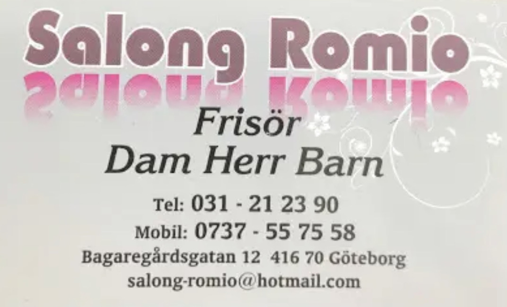
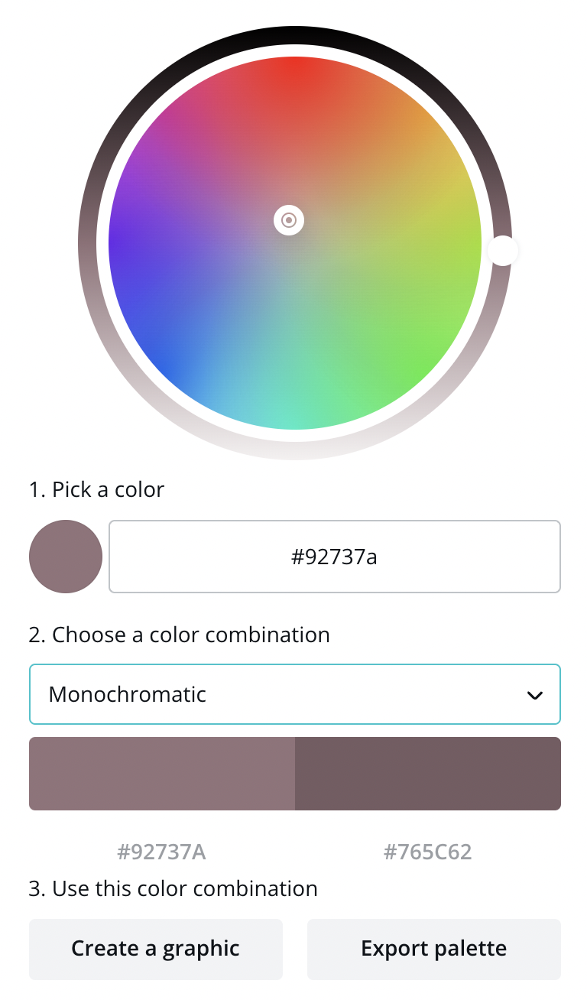
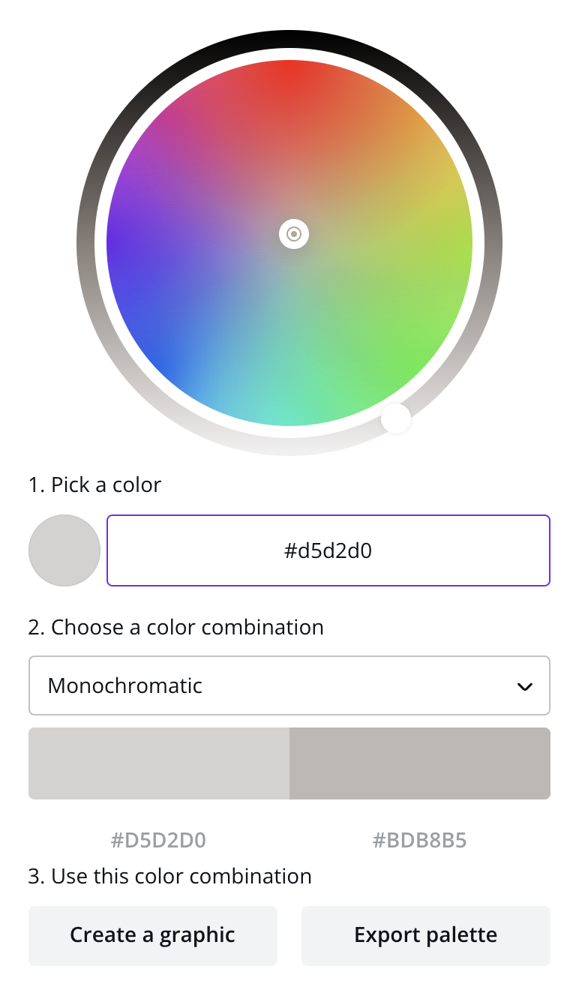
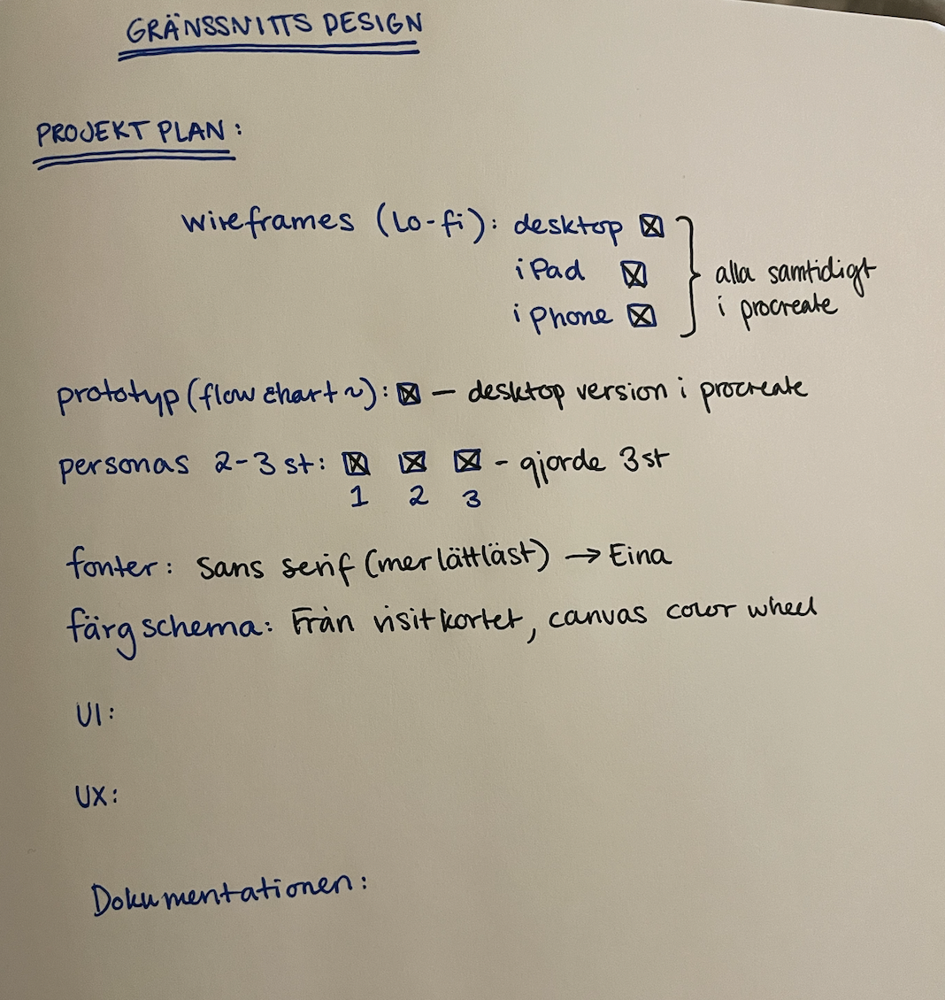
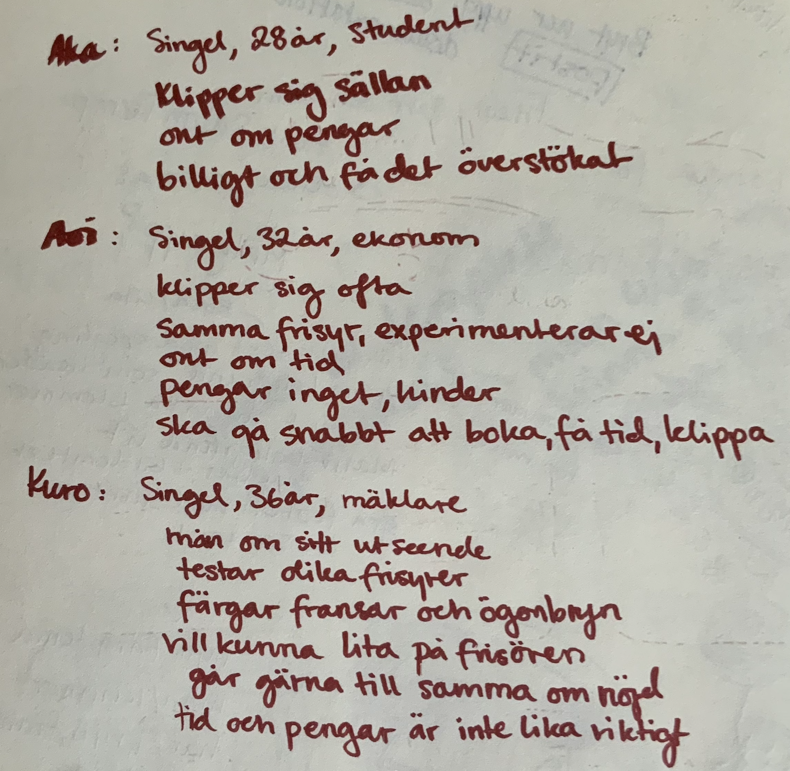
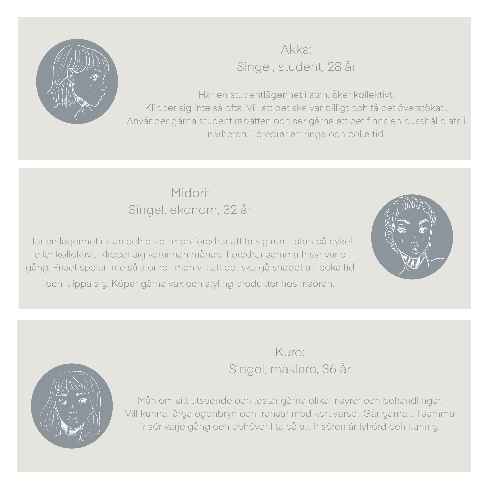
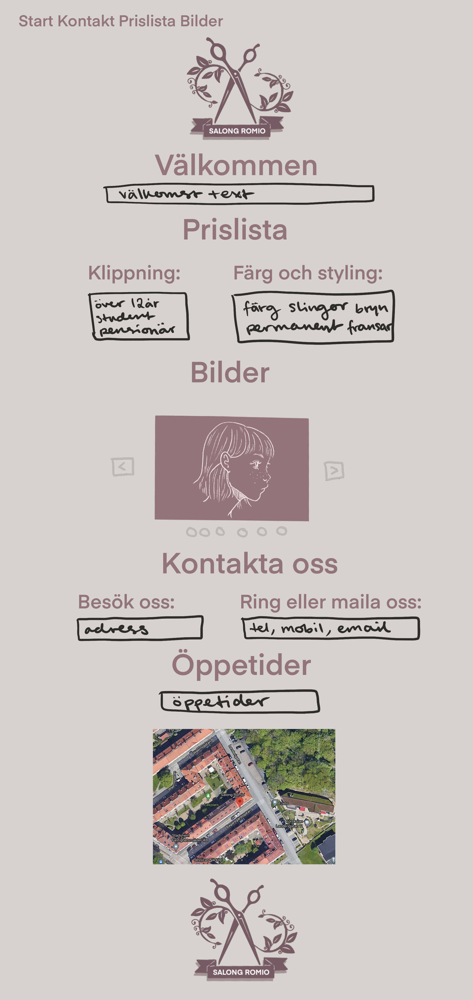
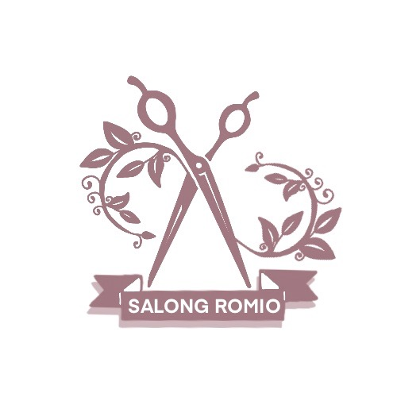
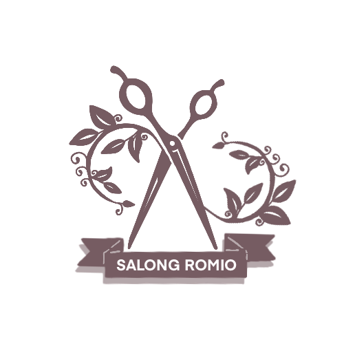

# Salong Romio

## Dokumentation

I det här projektet är gränssnittsdesign i fokus och uppgiften var att skapa en hemsida med välgenomtänkt UI och UX. Jag
valde att göra en hemsida för min frisör. Hon frågade om jag kunde hjälpa henne med hennes hemsida. Hon ville
framförallt att det skulle vara tydligt att se öppetider, telefonnummer, prislista och adressen. Jag valde att göra en
logga för det här projektet även om hon inte bad om en. När det gällde färger och typsnitt så har jag utgått från
salongens visitkort som inspiration. Och valde ett monochromatic
color sheme från [Canva](https://www.canva.com/colors/color-wheel/) för loggan. Samt en grå variant från 
visitkortet till hemsidans bakgrund.

Valde att ha brödtexten svart som på kortet.

Jag valde att prova en analog projektplan den här gången. Delade upp den efter vad vi skulle leverera i projektet. Hade även en hel hög med post-it notiser..

Till mina personas gjorde jag först en skiss och sen skrev jag rent dem i procreate.

Här är mina wireframes i low fidelity för desktop, table and mobile:

Och en mer detaljerad prototyp med färgskalan på ett ungefär:

När det gäller fonts så valde jag Eina som jag brukar använda i
procreate.

## Beskriv lite olika lösningar du gjort:

Jag ville göra en logga till sidan. Dels för att direkt kunna se vad sidan handlar om samt få mer användning av färgerna. Jag ville ha en ganska stilren logga som skulle kunna gå att få med både namnet och en sax, för att visa att det handlar om att klippa sig. Först så gjorde jag den i samma färg som texten på visitkortet men blev inte riktigt nöjd med den. Så testade en mörkare, monochromatic från canva som kändes bättre.

Funderade på att göra en drop down men körde istället med en navbar som följer med. Den länkar till titlarna istället för att byta sida.
Jag valde att ha all information på en sida efter som det viktigaste att få med var prislista, öppetider, adress och telefonnummer. Det blev totalt inte så mycket text och kändes därför enklare att hålla det på samma sida.

Letade efter inspiration på google efter hur andra lagt upp informationen och det var så många olika varianter att jag valde att bara utgå från en tidigare hemsida jag gjort nyligen.

## Beskriv något som var besvärligt att få till. 

Det svåraste för mig var att hitta en font. Jag valde Eina i slutändan som kan kännas lite tråkig men jag ville inte ha en för snirklig stil som skulle bli jobbig att läsa eller ses som alldeles för feminin. 

Hade även problem med den responsiva designen. I min prototyp hade jag tänkt använda flex för att skriva priserna och kontakt informationen i två kolumner i desktop läge men lät tillslut dem vara kvar i en kolumn, som i mobilläget.

## Beskriv hur du felsökt ditt program när det uppstått problem 

Inspektorn i webbläsare var min bästa hjälp. Framförallt när det gällde bilder i de olika enheterna. Lättare att se med inspektera öppet när jag ändrade något i css.

## Vad gick bra och vad gick dåligt

Jag tycker att loggan blev bra, de jag har frågat ser direkt att det handlar om en frisörsalong. Är ändå ganska nöjd med färg temat, det går att se att den hör ihop med visitkortet. Jag fick med det som kunden tyckte var viktigast men skulle vilja fått till UX/UI lite bättre. Sidan flyter på helt okej och går att läsa och hitta vad som är viktigt men layouten kunde gjorts mycket snyggare. Är nöjd med mina personas, var väldigt osäker på hur mycket information som behöövdes men tycker de funkar bra till det här projektet.
Jag lärde mig en hel del om fonts under den här kursen och ändå valde jag en ganska intetsägande Eina för den var lättläst och enkel att implementera. Annars tyckte jag avenue och aoki var väldigt fina typsnitt. Canvas color wheel var också ett väldigt användbart hjälpmedel under den här kursen.
Det var lite svårt att ha en kund som inte var speciellt engagerad i processen. Tänker att till nästa gång jag gör ett arbete åt någon är det viktigt att lägga fram en plan tidigt och uppdatera under arbetets gång med jämnare mellanrum. Tyvärr blir det lite klurigt under jul och nyår eftersom hon var bortrest och jag jobbade en hel del på annat håll. Finns mycket att förbättra där.

## Motivera varför du valt en specifik lösning. 

Jag valde att lägga in en iframe från google maps istället för att
skriva var det lättast går att ta sig till salongen kollektivt.
Det är dessutom lättare att se parkerings möjligheter samt hur man tar sig dit på enklast sätt med rekommendationer från google.
Google har även recensioner, eller visar betyg i form av stjärnor i hörnet på sin karta så det underlättar att se vad andra tyckte om upplevelsen där på ett ungefär.

## Lämna förslag på förbättringar av din kod. 

Lägga ner mer tid på att göra den flytande och responsiv över alla enheter. Nu är den alldeles för mobil fokuserad. Efter som det är en ganska enkel sida utan speciellt mycket information så är koden i sig rätt enkel. Jag tog en bildkarusell från W3schools som jag kanske kunde lekt med lite mer, nu är den i enklaste laget.

## Lämna exempel på lösningar du valde att inte implementera

Skulle vilja implemetera mer JS nästa gång och våga prova flerr saker. Hade en idé om att göra hela projektet i JS eftersom jag
inte lyckades med det i ett tidigare projekt. 

Jag valde även att inte följa min prototyp helt och hållet. Större delen av sidan är endast för mobil. Utgick lite från att det är då folk kommer se på hemsidan som mest så var okej med det.

