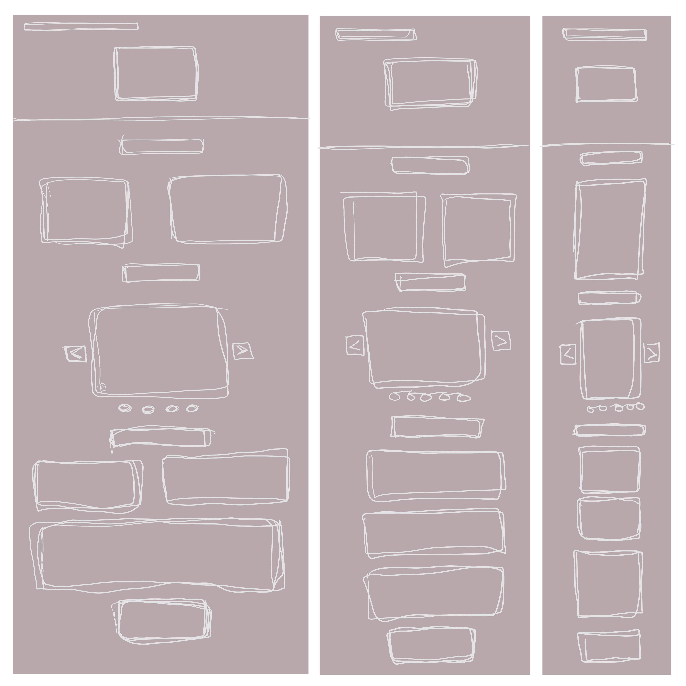

# Salong Romio

## Dokumentation

I det här projektet är gränssnittsdesign i fokus och uppgiften var att skapa en hemsida med välgenomtänkt UI och UX. Jag
valde att göra en hemsida för min frisör. Hon frågade om jag kunde hjälpa henne med hennes hemsida. Hon ville
framförallt att det skulle vara tydligt att se öppetider, telefonnummer, prislista och adressen. Jag valde att göra en
logga för det här projektet även om hon inte bad om en. När det gällde färger och typsnitt så har jag utgått från
salongens visitkort som inspiration. Och valde ett monochromatic
color sheme från [Canva](https://www.canva.com/colors/color-wheel/) för loggan. Samt en grå variant från 
visitkortet till hemsidans bakgrund.

Valde att ha brödtexten svart som på kortet.

Jag valde att prova en analog projektplan den här gången. Delade upp den efter vad vi skulle leverera i projektet.

Till mina personas gjorde jag först en skiss och sen skrev jag rent dem i procreate.

Här är mina wireframes i low fidelity för desktop, table and mobile:

Och en mer detaljerad prototyp med färgskalan på ett ungefär:

När det gäller fonts så valde jag Eina som jag brukar använda i
procreate.

## Beskriv lite olika lösningar du gjort:

Jag ville göra en logga till sidan. Dels för att direkt kunna se vad sidan handlar om samt få mer användning av färgerna. Jag ville ha en ganska stilren logga som skulle kunna gå att få med både namnet och en sax, för att visa att det handlar om att klippa sig. Först så gjorde jag den i samma färg som texten på visitkortet men blev inte riktigt nöjd med den. Så testade en mörkare, monochromatic från canva som kändes bättre.

Funderade på att göra en drop down men körde istället med en navbar som följer med. Den länkar till titlarna istället för att byta sida.
Jag valde att ha all information på en sida efter som det viktigaste att få med var prislista, öppetider, adress och telefonnummer. Det blev totalt inte så mycket text och kändes därför enklare att hålla det på samma sida.

Letade efter inspiration på google efter hur andra lagt upp informationen och det var så många olika varianter att jag valde att bara utgå från en tidigare hemsida jag gjort nyligen.

## Beskriv något som var besvärligt att få till. 

Det svåraste för mig var att hitta en font. Jag valde Eina i slutändan som kan kännas lite tråkig men jag ville inte ha en för snirklig stil som skulle bli jobbig att läsa eller ses som alldeles för feminin. 

Beskriv om du fått byta lösning och
varför i sådana fall. Använd korrekta begrepp och syntax i dina beskrivningar. I utvärderingen diskuterar eleven
översiktligt hur det egna gränssnittet förhåller sig till generella principer för hur en god användarupplevelse skapas.
Beskriv hur du felsökt ditt program när det uppstått problem Utvärdera din inlämning Vad gick bra Vad gick dåligt Vad
har du lärt dig Vilka möjligheter ser du med de kunskaper du fått under kursen. Eleven gör en noggrann dokumentation av
sitt arbete med UX samt utvärderar med nyanserade omdömen sitt arbete och resultat utifrån projektplanen. Motivera
varför du valt en specifik lösning. Lämna förslag på förbättringar av din kod. Lämna exempel på lösningar du valde att
inte implementera
